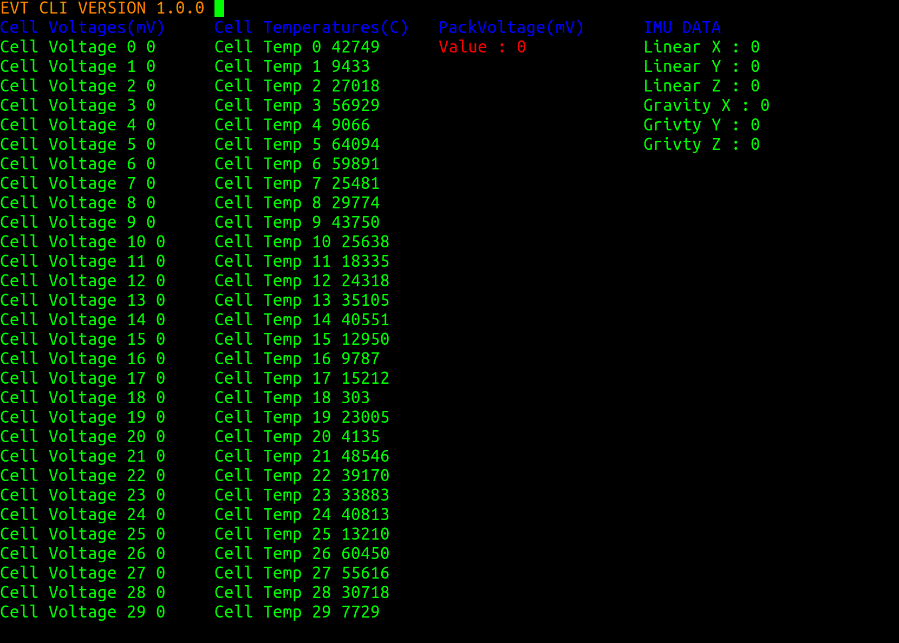

# EVTCLI

The CLI is an application developed using the gateway framework to display
the current stats and variables of the EVTCAN CAN bus.




## How to Run

To run on virtual interfaces execute the following in the evtcli directory

```
gateway start
```
to run on physical can interfaces aka, the bike execute the following in the evtcli directory
```
gateway start --environment production
```

## Notes

 1. This version supports up to 30 cells.
